# object_detector
Object Detector using HOG as descriptor and Linear SVM as classifier


## Prerequisites
Install [OpenCV 3](https://github.com/opencv/opencv) with Python 3 bindings


## Dependencies
You can install all dependencies by running
```shell
pip install -r requirements.txt
```


## Run the code
To test the code, run the lines below in your terminal

```shell
git clone https://github.com/vladkha/object_detector.git
cd object_detector/bin
python test_object_detector.py
```

_The `test_object_detector.py` will download the
[CelebA](http://mmlab.ie.cuhk.edu.hk/projects/CelebA.html) and [WIDER FACE](http://mmlab.ie.cuhk.edu.hk/projects/WIDERFace/)
datasets and train a classifier to detect faces in an image.
The SVM model files will be stored in `data/models`,
so that they can be reused later on in `test_classifier.py`_


## Configuration File
All the configurations are in the `data/config/config.cfg` configuration files.
You can change it as per your need.
Here is what the default configuration file looks like

```bash
[hog]
window_size: [178, 218]
window_step_size: 20
orientations: 9
pixels_per_cell: [8, 8]
cells_per_block: [3, 3]
visualise: False
normalise: None

[nms]
threshold: 0.4

[paths]
model_path: ../data/models/model_name.model

[general]
pyramid_downscale = 1.5
pos_samples = 1000
neg_samples = 1000
```


## About modules
* `config.py` -- imports the configuration variables from `config.cfg`
* `create_neg_samples_WIDER.py` -- module to create negative samples (images of non-faces from WIDER dataset)
* `extract_features.py` -- module used to extract HOG features of the training images
* `train_classifier.py` -- module used to train the classifier
* `test_classifier.py` -- module used to test the classifier using a test image
* `utils.py` -- module containing helper functions


## Some results
_Detections before NMS_             |  _Detections after NMS_
:-------------------------:|:-------------------------:
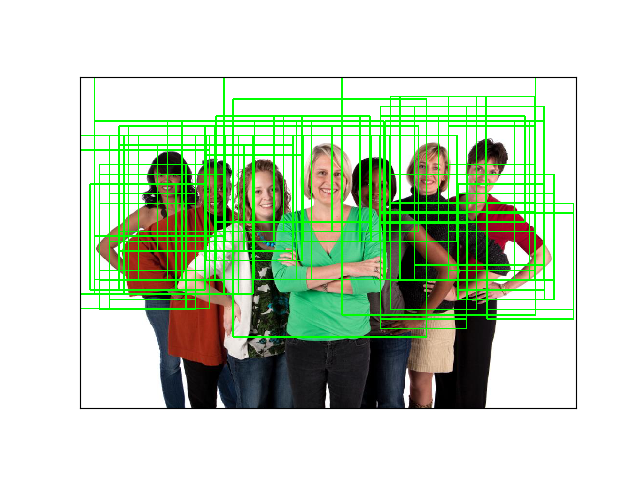 |  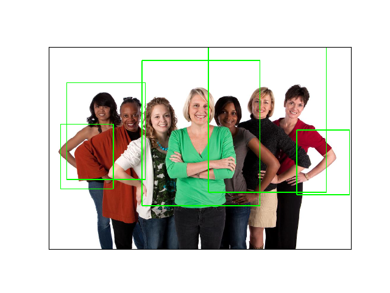
 |  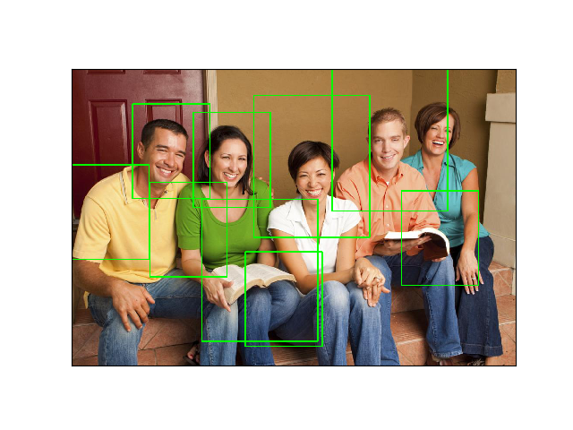
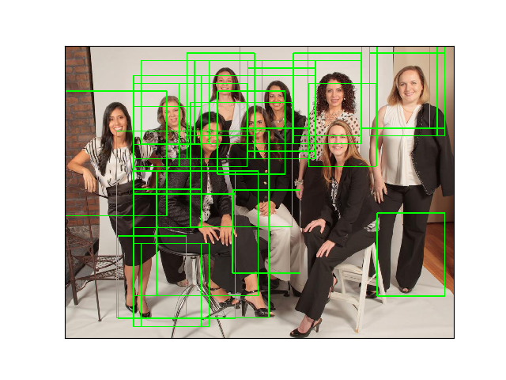 |  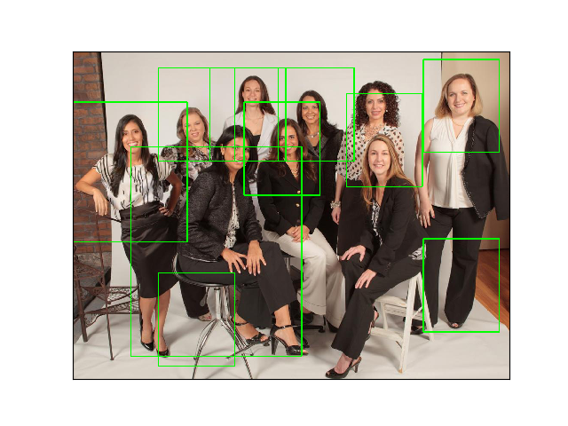
 |  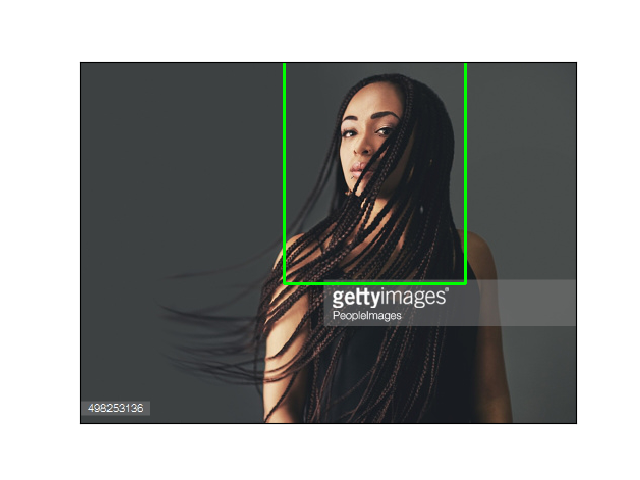
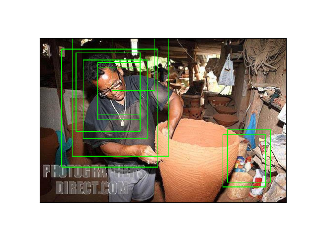 |  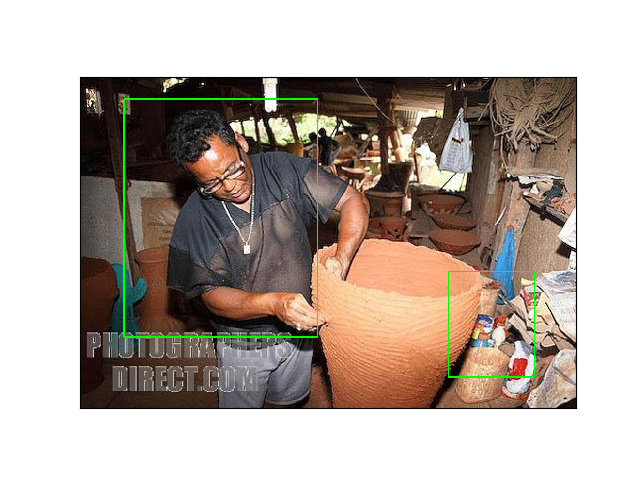
 |  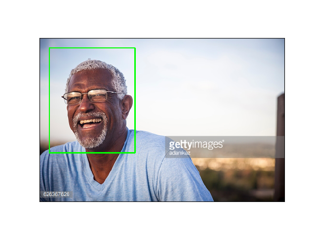
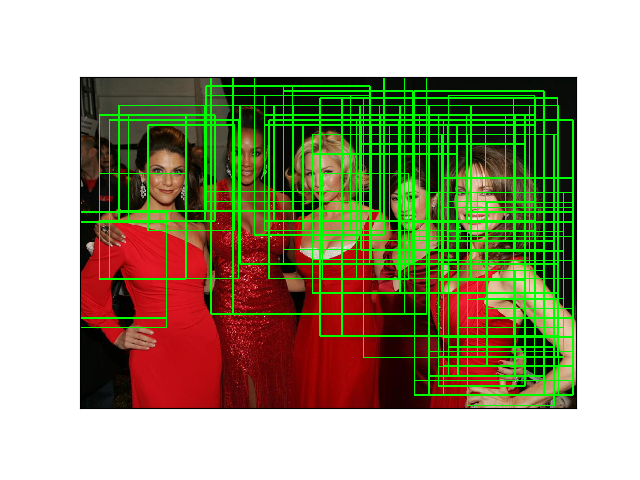 |  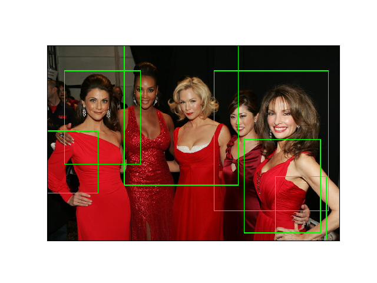


## Built With
* [OpenCV 3](https://github.com/opencv/opencv) - Computer vision library
* [Scikit-learn](https://github.com/scikit-learn/scikit-learn) - Machine learning library
* [scikit-image](https://github.com/scikit-image/scikit-image) - Image processing library


## TODO
Possible ways to improve the project:
* Make the sliding window computation run in parallel - can dramatically speedup the code
* Split processing of the image pyramid in `test_classifier` to different cores of the processor, that way each core can process a separate layer of the pyramid independently
* Add bootstrapping (Hard Negative Mining)


## Acknowledgments
* Credit for base project structure and image processing goes [bikz05](https://github.com/bikz05) for his [object-detector](https://github.com/bikz05/object-detector)
* [Adrian Rosebrock](https://github.com/jrosebr1) for his great blog [www.pyimagesearch.com](https://www.pyimagesearch.com/) and particular series of articles regarding object detection topic:
    - [Histogram of Oriented Gradients and Object Detection](https://www.pyimagesearch.com/2014/11/10/histogram-oriented-gradients-object-detection/)
    - [Non-Maximum Suppression for Object Detection in Python](https://www.pyimagesearch.com/2014/11/17/non-maximum-suppression-object-detection-python/)
    - [(Faster) Non-Maximum Suppression in Python](https://www.pyimagesearch.com/2015/02/16/faster-non-maximum-suppression-python/)
    - [Intersection over Union (IoU) for object detection](https://www.pyimagesearch.com/2016/11/07/intersection-over-union-iou-for-object-detection/)
    - [Image Pyramids with Python and OpenCV](https://www.pyimagesearch.com/2015/03/16/image-pyramids-with-python-and-opencv/)
    - [Sliding Windows for Object Detection with Python and OpenCV](https://www.pyimagesearch.com/2015/03/23/sliding-windows-for-object-detection-with-python-and-opencv/)
    - [Pedestrian Detection OpenCV](https://www.pyimagesearch.com/2015/11/09/pedestrian-detection-opencv/)
    - [HOG detectMultiScale parameters explained](https://www.pyimagesearch.com/2015/11/16/hog-detectmultiscale-parameters-explained/)


## License
This project is licensed under the MIT License - see the [LICENSE](LICENSE.md) file for details